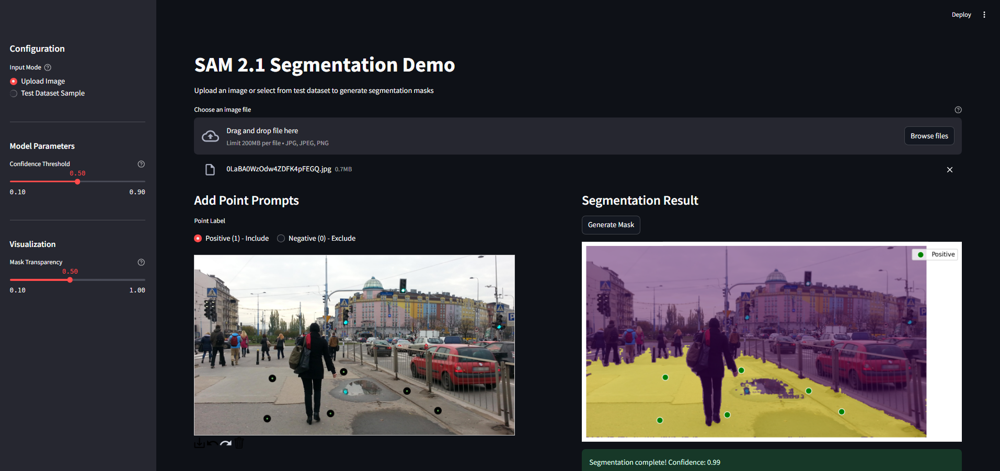

# SAM2 Sidewalk Training

This repository contains code for training and fine-tuning the SAM2 model on sidewalk segmentation datasets. It includes data loading, augmentation, training, checkpointing, and evaluation utilities.

---

## Table of Contents

- [Project Structure](#project-structure)
- [Installation](#installation)
- [Preprocessing](#preprocessing)
- [Visualization](#visualization)
- [Configuration](#configuration)
- [Training Parameters](#training-parameters)
- [How to Set Training Parameters](#how-to-set-training-parameters)
- [Training](#training)
- [Resuming from Checkpoint](#resuming-from-checkpoint)
- [Inference](#inference)
- [Acknowledgements](#acknowledgements)

---

## Project Structure

```
sidewalk_training/
├── checkpoints/           # Pretrained model checkpoints
├── configs/               # YAML config files
├── dataset/               # Dataset folder
├── images/                # Example images
├── logs/                  # TensorBoard logs
├── models/                # Saved models/checkpoints
├── results/               # Output results
├── sam2/                  # SAM2 model code
├── scripts/               # Utility scripts (dataloader, parameters, trainer, etc.)
├── train.py               # Main training script
├── inference.py           # Inference script
├── preprocess.py          # Preprocessing script
├── visualization.py       # Visualization utilities
├── requirements.txt       # Python dependencies
└── README.md              # This file
```

---

## Installation

1. **Create a virtual environment:**

   ```bash
   python -m venv venv
   ```

2. **Activate the virtual environment:**

   ```bash
   venv/Scripts/Activate
   ```

3. **Clone the repository:**

   ```bash
   git clone <your-repo-url>
   cd sidewalk_training
   ```

4. **Install dependencies:**

   ```bash
   git clone <your-repo-url>
   cd sidewalk_training
   ```

5. **Install dependencies:**

   ```bash
   pip install -r requirements.txt
   ```

6. **Download pretrained_models of Sam2.1 (tiny, small, base and large versions):**

   ```bash
   cd sam2/pretrained_models
   bash download_ckpts.sh
   cd ..
   ```

7. **Place your dataset in a folder named `dataset/`.** (Similar to how it is shown in the screenshot below)

   

8. **Update the dataset paths in `preprocess.py` using the appropriate config file from the `configs/` directory.**

   _Note: After running the preprocess.py script, it will create a preprocessed version of the same dataset. As shown in the screenshot above, e.g., "SENSATION_DS_Preprocessed"._

   ```bash
   cd sam2/pretrained_models
   bash download_ckpts.sh
   cd ..
   ```

9. **Place your dataset in a folder named `dataset/`.** (Similar to how it is shown in the screenshot below)

   

10. **Update the dataset paths in `preprocess.py` using the appropriate config file from the `configs/` directory.**

    _Note: After running the preprocess.py script, it will create a preprocessed version of the same dataset. As shown in the screenshot above, e.g., "SENSATION_DS_Preprocessed"._

---

## Preprocessing

Run the preprocessing script to resize images, create masks, and generate prompt JSONs.

```bash
python preprocess.py
```

This will create a new `preprocessed/` directory with the following:

- Resized images
- Masks
- JSON files which contain Point Prompts (Positive and Negative Points)

## Visualization

You can visualize the selected prompt points and their overlay on masks using:

```bash
python visualization.py
```

This is helpful for verifying prompt generation strategies.

## Configuration

Edit the YAML config files in `configs/` to set dataset paths, model configs, and other initialization parameters.  
For example, `configs/initialize_config.yaml`:

```yaml
TRAIN_MANIFEST: "dataset/SENSATION_DS/train_manifest.json"
VAL_MANIFEST: "dataset/SENSATION_DS/val_manifest.json"
CONFIG_PATH: "sam2/configs/sam2.1"
CONFIG_NAME: "sam2.1_hiera_base_plus.yaml"
PRETRAINED_MODEL_PATH: "checkpoints"
MODEL_NAME: "sam2.1_hiera_base_plus.pt"
CHECKPOINT_PATH: "models"
```

---

## Training Parameters

All training hyperparameters are managed by the [`TrainingParams`](scripts/parameters.py) class in [`scripts/parameters.py`](scripts/parameters.py).  
You can set or override these parameters in your `train.py` script.

**Default parameters include:**

- `output_dir`: Directory to save models/checkpoints
- `logging_dir`: Directory for TensorBoard logs
- `logging_steps`: Steps between logging
- `gradient_accumulation_steps`: Gradient accumulation steps
- `total_steps`: Total training steps
- `learning_rate`: Learning rate
- `warmup_steps`: Warmup steps
- `weight_decay`: Weight decay
- `fp16`: Use FP16 mixed precision (bool)
- `bf16`: Use BF16 mixed precision (bool)
- `save_steps`: Steps between checkpoints
- `eval_steps`: Steps between evaluations
- `save_total_limit`: Max number of checkpoints to keep
- `load_best_model_at_end`: Load best model at end (bool)
- `greater_is_better`: If higher metric is better (bool)
- `train_prompt_encoder`: Train prompt encoder (bool)
- `train_mask_decoder`: Train mask decoder (bool)
- `bce_weight`, `dice_weight`, `score_weight`: Loss weights

See [`scripts/parameters.py`](scripts/parameters.py) for the full list and defaults.

---

## How to Set Training Parameters

You can set training parameters in your `train.py` like this:

```python
from scripts.parameters import TrainingParams

training_args = TrainingParams(
    output_dir="models",
    logging_dir="logs",
    logging_steps=100,
    gradient_accumulation_steps=8,
    total_steps=5000,
    learning_rate=3e-5,
    warmup_steps=500,
    weight_decay=0.01,
    fp16=True,                # Use FP16 mixed precision
    bf16=False,               # Or set to True for BF16
    save_steps=100,
    eval_steps=100,
    save_total_limit=2,
    load_best_model_at_end=True,
    greater_is_better=True,
    train_prompt_encoder=True,
    train_mask_decoder=True,
    bce_weight=0.2,
    dice_weight=0.5,
    score_weight=0.3,
)
```

You can also load parameters from a YAML or JSON file and pass them as keyword arguments:

```python
import yaml
with open("configs/training_params.yaml") as f:
    params_dict = yaml.safe_load(f)
training_args = TrainingParams(**params_dict)
```

---

## Training

To start training, run:

```bash
accelerate launch train.py
```

The script will automatically look for the latest checkpoint in your checkpoint directory and resume training if found.

---

## Resuming from Checkpoint

The training script will automatically resume from the latest checkpoint in the directory specified by `CHECKPOINT_PATH` in your config.  
If no checkpoint is found, training starts from scratch.

---

## Inference

After training, use `inference.py` to run predictions on new images.  
Refer to the script and model documentation for usage.

---

## Streamlit Application

You can launch the streamlit app using:

```bash
streamlit run Streamlit_App.py
```

This will allow you to visualize the performance of the trained model, in two ways

1. Via Upload of Image and Point Prompts
2. Via Test Dataset Sample

   

## Acknowledgements

- [Meta Research SAM2](https://github.com/facebookresearch/sam2)
- [PyTorch](https://pytorch.org/)
- [HuggingFace Accelerate](https://github.com/huggingface/accelerate)

---

**For questions or issues, please open an issue on this repository.**
