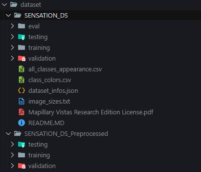

# SAM2 - Fine-Tuning on Multi-Class Masks for improvement of official SENSATION dataset.

This repository contains code for training and fine-tuning the SAM2 model on sidewalk segmentation datasets. It includes data loading, augmentation, training, checkpointing, and evaluation utilities.

---

## Table of Contents

- [Project Structure](#project-structure)
- [Installation](#installation)
- [Configuration](#configuration)
- [Training Parameters](#training-parameters)
- [Training](#training)
- [Inference](#inference)
- [Evaluate](#streamlit-application)
- [Acknowledgements](#acknowledgements)

---

## Project Structure

```
sidewalk_training/
├── checkpoints/           # Pretrained model checkpoints
├── configs/               # YAML config files
├── dataset/               # Dataset folder
├── images/                # Example images
├── logs/                  # TensorBoard logs
├── models/                # Saved models/checkpoints
├── sam2/                  # SAM2 model code
├── scripts/               # Utility scripts (dataloader, parameters, trainer, etc.)
├── evaluate_iou.py        # script to evaluate IOU score of model
├── inference.py           # Inference script
├── README.md              # This file
├── requirements.txt       # Python dependencies
└── train.py               # Main training script
```

---

## Installation

1. **Create a virtual environment:**

   ```bash
   python -m venv venv
   ```

2. **Activate the virtual environment:**

   ```bash
   venv/Scripts/Activate
   ```

3. **Clone the repository:**

   ```bash
   git clone <your-repo-url>
   cd sidewalk_training
   ```

4. **Install dependencies:**

   ```bash
   git clone <your-repo-url>
   cd sidewalk_training
   ```

5. **Install dependencies:**

   ```bash
   pip install -r requirements.txt
   ```

6. **Download pretrained_models of Sam2.1 (tiny, small, base and large versions):**

   ```bash
   cd checkpoints
   bash download_ckpts.sh
   cd ..
   ```

   or 
   
   You can access already uploaded pretrained models of SAM2 in the following path 

   ```bash
   sam2/pretrained_models
   ```

   which consist of : 
   - sam2.1_hiera_large.pt
   - sam2.1_hiera_base_plus.pt
   - sam2.1_hiera_small.pt
   - sam2.1_hiera_tiny.pt

7. Place your dataset in a folder named `dataset/`, which should include two subfolders: `images` (for input images) and `masks` (for corresponding segmentation masks). 
This structure is illustrated in the screenshot below.

   

---

## Configuration

Edit the YAML config files in `configs/` to set dataset paths, model configs, and other initialization parameters.  
For example, `configs/initialize_config.yaml`:

## How to Set Training Parameters

```yaml
# Dataset Path
DATA_PATH: "dataset/SENSATION_DS"

# Model configurations
PRETRAINED_MODEL_PATH: "sam2/pretrained_models"
MODEL_NAME: sam2.1_hiera_base_large.pt
CONFIG_PATH: "configs/sam2.1"
CONFIG_NAME: sam2.1_hiera_l.yaml

# Checkpoint Path
CHECKPOINT_PATH: "models/checkpoint"

Training_parameters:
  output_dir: "models"
  logging_dir: "logs"
  logging_steps: 100
  gradient_accumulation_steps: 8
  total_steps: 14300
  learning_rate: 1e-5
  warmup_steps: 500
  weight_decay: 0.001
  fp16: true
  save_steps: 100
  eval_steps: 100
  save_total_limit: 2
  load_best_model_at_end: true
  greater_is_better: true
  train_prompt_encoder: false
  train_mask_decoder: true
  train_image_encoder: false
  point_strategy: "laplace"
  num_pts: 4
  score_weight: 0.05
  unfreeze: False
  use_lora: True
  lora_r: 8
  lora_alpha: 16
  lora_dropout: 0.1
  lora_target_modules: [
      "linear1",
      "linear2", # MLPs in MemoryAttentionLayer
      "pwconv1",
      "pwconv2", # ConvNext blocks in mask decoder
      "q_proj",
      "k_proj",
      "v_proj", # Cross-attention projections
    ]
```

---

## Training Parameters

All training hyperparameters are managed by the [`TrainingParams`](scripts/parameters.py) class in [`scripts/parameters.py`](scripts/parameters.py).

**Default parameters include:**

## Training Configuration

### Output & Logging

- `output_dir`: `models/` — Saves model checkpoints.
- `logging_dir`: `logs/` — TensorBoard and text logs.
- `logging_steps`: 100 — Logs every 100 steps.

### Training Schedule

- `gradient_accumulation_steps`: 8 — Simulates larger batch size.
- `total_steps`: 14,300 — Total training iterations.
- `save_steps`: 100 — Save checkpoint every 100 steps.
- `eval_steps`: 100 — Evaluate model every 100 steps.
- `save_total_limit`: 2 — Keep only the 2 most recent checkpoints.
- `load_best_model_at_end`: True — Automatically reload best model.
- `greater_is_better`: True — Higher metric (IoU) is better.

### Optimization

- `learning_rate`: `1e-5`
- `warmup_steps`: `500`
- `weight_decay`: `0.001`
- `fp16`: `true` — Enable mixed precision training.

---

## Fine-tuning Strategy

### LoRA (Low-Rank Adaptation)

- `use_lora`: `true`
- `lora_r`: `8` — Rank of adaptation matrix.
- `lora_alpha`: `16` — LoRA scaling factor.
- `lora_dropout`: `0.1`
- `lora_target_modules`: Applied to key layers:
  - `linear1`, `linear2` — MemoryAttentionLayer
  - `pwconv1`, `pwconv2` — ConvNeXt blocks
  - `q_proj`, `k_proj`, `v_proj` — Attention layers

### Modules Trained

- `train_prompt_encoder`: `false`
- `train_mask_decoder`: `true`
- `train_image_encoder`: `false`
- `unfreeze`: `false` — Only LoRA-injected layers are trainable.

---

## Prompting Strategy

- `point_strategy`: `"laplace"` — Probabilistic prompt generation.
- `num_pts`: `4` — Number of prompt points per image.
- `score_weight`: `0.05` — Balances mask and score loss.

---

## Training

To start training, run:

```bash
python train.py or accelerate launch train.py \
    --initial-config-file <path_to_initialize_config.yaml> \
    --pretrained-model-path <path_to_pretrained_model> \
    --model-name <model_filename.pth> \
    --model-config-path <path_to_model_configs> \
    --model-config-name <config_filename.yaml> \
    [--checkpoint-path <path_to_checkpoints>] \
    [--resume]
```

Required Arguments

- `--initial-config-file`: Path to initialize config file
- `--pretrained-model-path`: Path to directory containing pretrained model
- `--model-name`: Filename of the pretrained model
- `--model-config-path`: Path to model configs folder
- `--model-config-name`: Name of the model config file (e.g., "sam2.1_hiera_l.yaml")

Optional Arguments

- `--checkpoint-path`: Path to save/load checkpoints (overrides config)
- `--resume`: Flag to resume training from latest checkpoint

Example:

```bash
python train.py \
    --initial-config-file configs/initialize_config.yaml \
    --pretrained-model-path sam2/pretrained_models \
    --model-name sam2_hiera_large.pt \
    --model-config-path sam2/configs/sam2.1 \
    --checkpoint-path outputs/checkpoints \
    --resume
```

The script will automatically look for the latest checkpoint in your checkpoint directory and resume training if found.

---

## Resuming from Checkpoint

The training script will automatically resume from the latest checkpoint in the directory specified by `CHECKPOINT_PATH` in your config.  
If no checkpoint is found, training starts from scratch.

---

## Inference

You need:

- A trained **SAM2 model** (`.pth` or similar)
- A **SAM2 config** YAML file
- A **SENSATION ONNX model** (`.onnx`)
- A **class colors CSV** (e.g., `class_colors.csv`)

## Usage

Run the script from the command line:

```bash
python inference.py \
  --input <input_images_folder> \
  --output <output_folder> \
  --sam2_model <path_to_sam2_model> \
  --sam2_config <path_to_sam2_config_yaml> \
  --onnx_model <path_to_sensation_onnx> \
  --class_csv <path_to_class_colors_csv> \
  [--pixel_points N] \
  [--iteration N] \
  [--pixel_select METHOD] \
  [--pixel_step N] \
  [--good_iou FLOAT] \
  [--min_iou FLOAT] \
  [--visualize]
```

### **Arguments**

| Argument         | Description                                      | Required | Default  |
| ---------------- | ------------------------------------------------ | -------- | -------- |
| `--input`        | Path to input images folder                      | Yes      |          |
| `--output`       | Output directory for masks and plots             | Yes      |          |
| `--sam2_model`   | Path to SAM2 model weights                       | Yes      |          |
| `--sam2_config`  | Path to SAM2 config YAML                         | Yes      |          |
| `--onnx_model`   | Path to SENSATION ONNX model                     | Yes      |          |
| `--class_csv`    | Path to class colors CSV                         | Yes      |          |
| `--pixel_points` | Number of pixel points per class                 | No       | 5        |
| `--iteration`    | Number of refinement iterations                  | No       | 10       |
| `--pixel_select` | Pixel selection method (`centroid`, `fps`, etc.) | No       | gaussian |
| `--pixel_step`   | Pixel step increase for poor masks               | No       | 1        |
| `--good_iou`     | Good IoU score threshold                         | No       | 0.80     |
| `--min_iou`      | Minimum acceptable IoU score                     | No       | 0.30     |
| `--visualize`    | Generate and save comparison plots               | No       | False    |

---

## Example

```bash
python inference.py \
  --input ./test_images \
  --output ./results \
  --sam2_model ./models/sam2.pth \
  --sam2_config ./configs/sam2.yaml \
  --onnx_model ./models/sensation.onnx \
  --class_csv ./configs/class_colors.csv \
  --pixel_points 8 \
  --iteration 5 \
  --pixel_select centroid \
  --visualize
```

## Evaluate

You can use the `evaluate_iou.py`
This script evaluates your trained SAM2 model on data provided using the `--data_root` argument, calculating Intersection-over-Union (IoU) metrics for each class and providing detailed performance analysis.

```bash
python evaluate_iou.py \
    --data_root <path_to_test_data> \
    --model <path_to_trained_model> \
    --config <path_to_model_config>
```

Example:

```bash
python evaluate_iou.py \
    --data_root ./dataset/SENSATION_DS_Preprocessed/testing \
    --model ./models/final_model.pt \
    --config configs/sam2.1/sam2.1_hiera_b+.yaml
```

Note: --data_root, should contain, images and masks folders

---

## Acknowledgements

- [Meta Research SAM2](https://github.com/facebookresearch/sam2)
- [PyTorch](https://pytorch.org/)
- [HuggingFace Accelerate](https://github.com/huggingface/accelerate)

---

**For questions or issues, please open an issue on this repository.**
